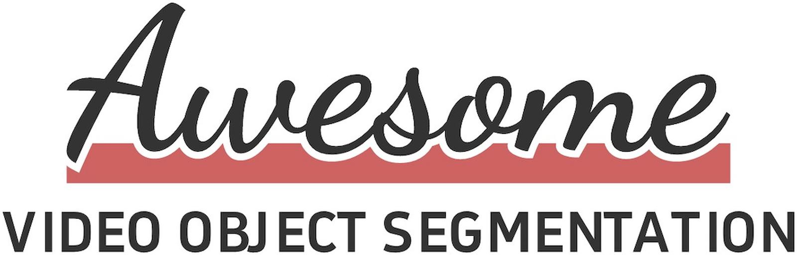
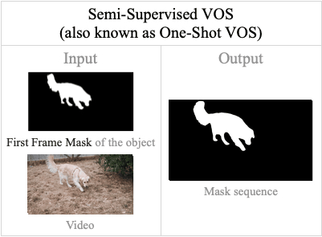
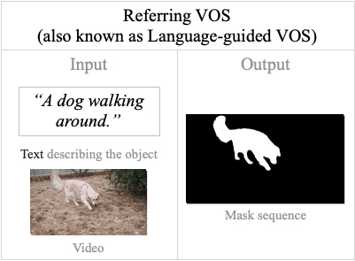
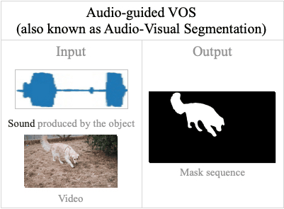
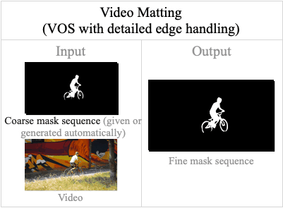

    
    
    

Recent Advances in Video Object Segmentation (VOS). VOS works before 2022 can be found in our survey paper:

>Deep Learning for Video Object Segmentation: A Review / [paper](https://link.springer.com/content/pdf/10.1007/s10462-022-10176-7.pdf) / [project page](https://github.com/gaomingqi/VOS-Review) 

BibTex
 @article{gao2023deep,
  title={Deep learning for video object segmentation: a review},
  author={Gao, Mingqi and Zheng, Feng and Yu, James JQ and Shan, Caifeng and Ding, Guiguang and Han, Jungong},
  journal={Artificial Intelligence Review},
  volume={56},
  number={1},
  pages={457--531},
  year={2023},
  publisher={Springer}
}

---

:teddy_bear: We mark different VOS tasks with coloured squares:

<table>
    <tr>
        <td style="width: 20%;">:blue_square:<code>SVOS</code></td>
        <td style="width: 30%;"></td>
        <td style="width: 20%;">:orange_square:<code>RVOS</code></td>
        <td style="width: 30%;"></td>
    </tr>
    <tr>
        <td style="width: 20%;">:green_square:<code>UVOS</code></td>
        <td style="width: 30%;"></td>
        <td style="width: 20%;">:red_square:<code>AVOS</code></td>
        <td style="width: 30%;"></td>
    </tr>
    <tr>
        <td style="width: 20%;">:diamond_shape_with_a_dot_inside:<code>VMAT</code></td>
        <td style="width: 30%;"></td>
        <td style="width: 20%;">:white_large_square:<code>XVOS</code></td>
        <td style="width: 30%;">Other types of VOS</td>
    </tr>
</table>

:teddy_bear: Please feel free to send us pull requests to add VOS works.

---

Links for a quick jump: [ArXiv (within 6 months)](#arxiv), 🔥[ICCV 2025](#iccv25)🔥, 🔥[CVPR 2025](#cvpr25)🔥, [ICLR 2025](#iclr25), [AAAI 2025](#aaai25), [Journals 2025](#j25), [Earlier ArXiv 2025](#a25), [NeurIPS 2024](#nips24), [ACMMM 2024](#acmmm24), [ECCV 2024](#eccv24), [CVPR 2024](#cvpr24), [AAAI 2024](#aaai24), [Journals 2024](#j24), [Earlier ArXiv 2024](#earxiv24), [EMNLP 2023](#emnlp23), [NeurIPS 2023](#nips23), [ACMMM 2023](#mm23), [ICCV 2023](#iccv23), [CVPR 2023](#cvpr23), [IJCAI 2023](#ijcai23), [AAAI 2023](#aaai23), [Journals 2023](#j23), [Earlier ArXiv 2023](#earxiv23), [NeurIPS 2022](#neurips22), [ECCV 2022](#eccv22), [CVPR 2022](#cvpr22), [AAAI 2022](#aaai22), [Journals 2022](#j22)

---
### 🏁 VOS Workshops and Challenges

No Active Workshops/Challenges.

Finished

:blue_square: `SVOS` :orange_square: `RVOS` &nbsp;&nbsp;&nbsp;-&nbsp;&nbsp;&nbsp; [LSVOS @ECCV 2024](https://lsvos.github.io/) (Finished)

:blue_square: `SVOS` &nbsp;&nbsp;&nbsp;-&nbsp;&nbsp;&nbsp; [VOTS @ECCV 2024](https://www.votchallenge.net/) (Finished)

:blue_square: `SVOS` :orange_square: `RVOS` &nbsp;&nbsp;&nbsp;-&nbsp;&nbsp;&nbsp; [PVUW @CVPR 2024](https://www.vspwdataset.com/Workshop2024.html) (Finished)

---
### :floppy_disk: VOS Dataset

Click to expand

:blue_square: `SVOS`: [SA-V](https://ai.meta.com/datasets/segment-anything-video/) (2024), [LVOS](https://lingyihongfd.github.io/lvos.github.io/dataset.html) (2023), [MOSE](https://henghuiding.github.io/MOSE/) (2023), [VOST](https://www.vostdataset.org/) (2023), [VISOR](https://epic-kitchens.github.io/VISOR/) (2022), [YouTube-VOS](https://youtube-vos.org/) (2018/2019), [DAVIS](https://davischallenge.org/index.html) (2016/2017)

:orange_square: `RVOS`: [ReVOS](https://github.com/cilinyan/ReVOS-api) (2024), [MeViS](https://henghuiding.github.io/MeViS/) (2023), [Ref-YouTube-VOS](https://youtube-vos.org/dataset/rvos/) (2020), [Ref-DAVIS](https://www.mpi-inf.mpg.de/departments/computer-vision-and-machine-learning/research/video-segmentation/video-object-segmentation-with-language-referring-expressions) (2018), [J-HMDB-Sentences](https://kgavrilyuk.github.io/publication/actor_action/) (2018), [A2D-Sentences](https://kgavrilyuk.github.io/publication/actor_action/) (2018)

:green_square: `UVOS`: [DAVIS](https://davischallenge.org/index.html) (2016)

:red_square: `AVOS`: [AVSBench](https://opennlplab.github.io/AVSBench/) (2022)

:diamond_shape_with_a_dot_inside: `VMAT`: [VideoMatte240K](https://grail.cs.washington.edu/projects/background-matting-v2/#/datasets) (2021), [CRGNN](https://github.com/TiantianWang/VideoMatting-CRGNN) (2021)

---

### ArXiv (Last 6 months)

:blue_square: `SVOS` `Jul` &nbsp;&nbsp;&nbsp;-&nbsp;&nbsp;&nbsp; [paper](https://arxiv.org/abs/2507.15852) / [code](https://github.com/OpenIXCLab/SeC) / [dataset](https://huggingface.co/datasets/OpenIXCLab/SeCVOS) &nbsp;&nbsp;&nbsp;-&nbsp;&nbsp;&nbsp; SeC: Advancing Complex Video Object Segmentation via Progressive Concept Construction

:blue_square: `SVOS` `Jul` &nbsp;&nbsp;&nbsp;-&nbsp;&nbsp;&nbsp; [paper](https://arxiv.org/abs/2507.07603) / [code](https://github.com/LouisFinner/HiM2SAM) &nbsp;&nbsp;&nbsp;-&nbsp;&nbsp;&nbsp; HiM2SAM: Enhancing SAM2 with Hierarchical Motion Estimation and Memory Optimization towards Long-term Tracking

:white_large_square: `XVOS` `Jul` &nbsp;&nbsp;&nbsp;-&nbsp;&nbsp;&nbsp; [paper](https://arxiv.org/abs/2507.07519) / [dataset](https://volumetric-repository.labs.b-com.com/#/muvod) &nbsp;&nbsp;&nbsp;-&nbsp;&nbsp;&nbsp; MUVOD: A Novel Multi-view Video Object Segmentation Dataset and A Benchmark for 3D Segmentation

:red_square: `AVOS` `Jun` &nbsp;&nbsp;&nbsp;-&nbsp;&nbsp;&nbsp; [paper](https://arxiv.org/abs/2506.11436) / code &nbsp;&nbsp;&nbsp;-&nbsp;&nbsp;&nbsp; TAViS: Text-bridged Audio-Visual Segmentation with Foundation Models

:orange_square: `RVOS` `Jun` &nbsp;&nbsp;&nbsp;-&nbsp;&nbsp;&nbsp; [paper](https://arxiv.org/pdf/2506.02356) / [project](https://cvlab-kaist.github.io/InterRVOS/) &nbsp;&nbsp;&nbsp;-&nbsp;&nbsp;&nbsp; InterRVOS: Interaction-aware Referring Video Object Segmentation

:red_square: `AVOS` `Jun` &nbsp;&nbsp;&nbsp;-&nbsp;&nbsp;&nbsp; [paper](https://arxiv.org/abs/2506.01015) / [code](https://github.com/yyliu01/AuralSAM2) &nbsp;&nbsp;&nbsp;-&nbsp;&nbsp;&nbsp; AuralSAM2: Enabling SAM2 Hear Through Pyramid Audio-Visual Feature Prompting

:orange_square: `RVOS` `May` &nbsp;&nbsp;&nbsp;-&nbsp;&nbsp;&nbsp; [paper](https://arxiv.org/abs/2505.08581) / [code](https://github.com/jinlab-imvr/ReSurgSAM2) &nbsp;&nbsp;&nbsp;-&nbsp;&nbsp;&nbsp; ReSurgSAM2: Referring Segment Anything in Surgical Video via Credible Long-term Tracking

:orange_square: `RVOS` `May` &nbsp;&nbsp;&nbsp;-&nbsp;&nbsp;&nbsp; [paper](https://arxiv.org/abs/2505.18561) / [code](https://github.com/DanielSHKao/ThinkVideo) &nbsp;&nbsp;&nbsp;-&nbsp;&nbsp;&nbsp; ThinkVideo: High-Quality Reasoning Video Segmentation with Chain of Thoughts

:orange_square: `RVOS` `May` &nbsp;&nbsp;&nbsp;-&nbsp;&nbsp;&nbsp; [paper](https://arxiv.org/abs/2505.12702) / [code](https://isee-laboratory.github.io/Long-RVOS) &nbsp;&nbsp;&nbsp;-&nbsp;&nbsp;&nbsp; Long-RVOS: A Comprehensive Benchmark for Long-term Referring Video Object Segmentation

:red_square: `AVOS` `May` &nbsp;&nbsp;&nbsp;-&nbsp;&nbsp;&nbsp; [paper](https://arxiv.org/abs/2505.01448) / code &nbsp;&nbsp;&nbsp;-&nbsp;&nbsp;&nbsp; OpenAVS: Training-Free Open-Vocabulary Audio Visual Segmentation with Foundational Models

:blue_square: `SVOS` `May` &nbsp;&nbsp;&nbsp;-&nbsp;&nbsp;&nbsp; [paper](https://arxiv.org/abs/2505.00739) / code &nbsp;&nbsp;&nbsp;-&nbsp;&nbsp;&nbsp; MoSAM: Motion-Guided Segment Anything Model with Spatial-Temporal Memory Selection

:blue_square: `SVOS` `Apr` &nbsp;&nbsp;&nbsp;-&nbsp;&nbsp;&nbsp; [paper](https://arxiv.org/abs/2504.16471) / code &nbsp;&nbsp;&nbsp;-&nbsp;&nbsp;&nbsp; RGB-D Video Object Segmentation via Enhanced Multi-store Feature Memory

:blue_square: `SVOS` `Apr` &nbsp;&nbsp;&nbsp;-&nbsp;&nbsp;&nbsp; [paper](https://arxiv.org/abs/2504.12080) / [code](https://github.com/zaplm/DC-SAM) &nbsp;&nbsp;&nbsp;-&nbsp;&nbsp;&nbsp; DC-SAM: In-Context Segment Anything in Images and Videos via Dual Consistency

:green_square: `UVOS` `Apr` &nbsp;&nbsp;&nbsp;-&nbsp;&nbsp;&nbsp; [paper](https://arxiv.org/abs/2504.05904) / code &nbsp;&nbsp;&nbsp;-&nbsp;&nbsp;&nbsp; Intrinsic Saliency Guided Trunk-Collateral Network for Unsupervised Video Object Segmentation

:orange_square: `RVOS` `Mar` &nbsp;&nbsp;&nbsp;-&nbsp;&nbsp;&nbsp; [paper](https://arxiv.org/abs/2503.21056) / code &nbsp;&nbsp;&nbsp;-&nbsp;&nbsp;&nbsp; Online Reasoning Video Segmentation with Just-in-Time Digital Twins

:diamond_shape_with_a_dot_inside: `VMAT` `Mar` &nbsp;&nbsp;&nbsp;-&nbsp;&nbsp;&nbsp; [paper](https://arxiv.org/abs/2503.10678) / [project page](https://bio.lehanyang.info/VRMDiff.github.io/) &nbsp;&nbsp;&nbsp;-&nbsp;&nbsp;&nbsp; VRMDiff: Text-Guided Video Referring Matting Generation of Diffusion

:diamond_shape_with_a_dot_inside: `VMAT` `Mar` &nbsp;&nbsp;&nbsp;-&nbsp;&nbsp;&nbsp; [paper](https://arxiv.org/abs/2503.01262) / code &nbsp;&nbsp;&nbsp;-&nbsp;&nbsp;&nbsp; Object-Aware Video Matting with Cross-Frame Guidance

:orange_square: `RVOS` `Mar` &nbsp;&nbsp;&nbsp;-&nbsp;&nbsp;&nbsp; [paper](https://arxiv.org/abs/2503.03492) / [code](https://github.com/suhwan-cho/FindTrack) &nbsp;&nbsp;&nbsp;-&nbsp;&nbsp;&nbsp; Find First, Track Next: Decoupling Identification and Propagation in Referring Video Object Segmentation

:green_square: `SVOS` `Feb` &nbsp;&nbsp;&nbsp;-&nbsp;&nbsp;&nbsp; [paper](https://arxiv.org/abs/2502.12975) / [code](https://github.com/danqu130/EvInsMOS) &nbsp;&nbsp;&nbsp;-&nbsp;&nbsp;&nbsp; Instance-Level Moving Object Segmentation from a Single Image with Events

:blue_square: `SVOS` `Feb` &nbsp;&nbsp;&nbsp;-&nbsp;&nbsp;&nbsp; [paper](https://arxiv.org/abs/2502.09660) / code &nbsp;&nbsp;&nbsp;-&nbsp;&nbsp;&nbsp; Towards Fine-grained Interactive Segmentation in Images and Videos

:red_square: `AVOS` `Feb` &nbsp;&nbsp;&nbsp;-&nbsp;&nbsp;&nbsp; [paper](https://arxiv.org/abs/2502.00358) / code &nbsp;&nbsp;&nbsp;-&nbsp;&nbsp;&nbsp; Do Audio-Visual Segmentation Models Truly Segment Sounding Objects?

:orange_square: `RVOS` `Jan` &nbsp;&nbsp;&nbsp;-&nbsp;&nbsp;&nbsp; [paper](https://arxiv.org/abs/2501.13667) / code &nbsp;&nbsp;&nbsp;-&nbsp;&nbsp;&nbsp; MPG-SAM 2: Adapting SAM 2 with Mask Priors and Global Context for Referring Video Object Segmentation

:blue_square: `SVOS` `Jan` &nbsp;&nbsp;&nbsp;-&nbsp;&nbsp;&nbsp; [paper](https://arxiv.org/abs/2501.07256) / code &nbsp;&nbsp;&nbsp;-&nbsp;&nbsp;&nbsp; EdgeTAM: On-Device Track Anything Model

:red_square: `AVOS` `Jan` &nbsp;&nbsp;&nbsp;-&nbsp;&nbsp;&nbsp; [paper](https://arxiv.org/abs/2501.07806) / [code](https://github.com/SitongGong/AVS-Mamba) &nbsp;&nbsp;&nbsp;-&nbsp;&nbsp;&nbsp; 
 AVS-Mamba: Exploring Temporal and Multi-modal Mamba for Audio-Visual Segmentation

:green_square: `UVOS` `Jan` &nbsp;&nbsp;&nbsp;-&nbsp;&nbsp;&nbsp; [paper](https://arxiv.org/abs/2501.07806) / [code](https://github.com/hy0523/MTNet) &nbsp;&nbsp;&nbsp;-&nbsp;&nbsp;&nbsp; 
 Learning Motion and Temporal Cues for Unsupervised Video Object Segmentation

:orange_square: `RVOS` `Jan` &nbsp;&nbsp;&nbsp;-&nbsp;&nbsp;&nbsp; [paper](https://arxiv.org/abs/2501.04939) / [code](https://github.com/Choi58/MTCM) &nbsp;&nbsp;&nbsp;-&nbsp;&nbsp;&nbsp; Multi-Context Temporal Consistent Modeling for Referring Video Object Segmentation

:orange_square: `RVOS` `Jan` &nbsp;&nbsp;&nbsp;-&nbsp;&nbsp;&nbsp; [paper](https://arxiv.org/abs/2501.04001) / [code](https://github.com/magic-research/Sa2VA) &nbsp;&nbsp;&nbsp;-&nbsp;&nbsp;&nbsp; Sa2VA: Marrying SAM2 with LLaVA for Dense Grounded Understanding of Images and Videos

---
### ICCV 2025
:blue_square: `SVOS` &nbsp;&nbsp;&nbsp;-&nbsp;&nbsp;&nbsp; [paper](https://arxiv.org/abs/2410.16268) / [code](https://github.com/Mark12Ding/SAM2Long) &nbsp;&nbsp;&nbsp;-&nbsp;&nbsp;&nbsp; SAM2Long: Enhancing SAM 2 for Long Video Segmentation with a Training-Free Memory Tree

:orange_square: `RVOS` &nbsp;&nbsp;&nbsp;-&nbsp;&nbsp;&nbsp; [paper](https://arxiv.org/abs/2501.14607) / [code](https://github.com/iSEE-Laboratory/ReferDINO) &nbsp;&nbsp;&nbsp;-&nbsp;&nbsp;&nbsp; ReferDINO: Referring Video Object Segmentation with Visual Grounding Foundations

:orange_square: `RVOS` &nbsp;&nbsp;&nbsp;-&nbsp;&nbsp;&nbsp; [paper](https://arxiv.org/abs/2412.14006) / [code](https://github.com/congvvc/InstructSeg) &nbsp;&nbsp;&nbsp;-&nbsp;&nbsp;&nbsp; InstructSeg: Unifying Instructed Visual Segmentation with Multi-modal Large Language Models

---
### CVPR 2025

:diamond_shape_with_a_dot_inside: `VMAT` &nbsp;&nbsp;&nbsp;-&nbsp;&nbsp;&nbsp; [paper](https://arxiv.org/abs/2501.14677) / [code](https://github.com/pq-yang/MatAnyone) &nbsp;&nbsp;&nbsp;-&nbsp;&nbsp;&nbsp; Stable Video Matting with Consistent Memory Propagation

:orange_square: `RVOS` &nbsp;&nbsp;&nbsp;-&nbsp;&nbsp;&nbsp; [paper](https://arxiv.org/abs/2411.17646) / [code](https://github.com/ClaudiaCuttano/SAMWISE) &nbsp;&nbsp;&nbsp;-&nbsp;&nbsp;&nbsp; SAMWISE: Infusing wisdom in SAM2 for Text-Driven Video Segmentation

:orange_square: `RVOS` &nbsp;&nbsp;&nbsp;-&nbsp;&nbsp;&nbsp; [paper](https://arxiv.org/abs/2501.08549) / [code](https://github.com/SitongGong/VRS-HQ) &nbsp;&nbsp;&nbsp;-&nbsp;&nbsp;&nbsp; The Devil is in Temporal Token: High Quality Video Reasoning Segmentation

:orange_square: `RVOS` &nbsp;&nbsp;&nbsp;-&nbsp;&nbsp;&nbsp; [paper](https://arxiv.org/abs/2412.09754) / [code](https://github.com/Ali2500/ViCaS) &nbsp;&nbsp;&nbsp;-&nbsp;&nbsp;&nbsp; ViCaS: A Dataset for Combining Holistic and Pixel-level Video Understanding using Captions with Grounded Segmentation

:orange_square: `RVOS` &nbsp;&nbsp;&nbsp;-&nbsp;&nbsp;&nbsp; [paper](https://arxiv.org/abs/2411.09921) / [code](https://github.com/dengandong/GroundMoRe) &nbsp;&nbsp;&nbsp;-&nbsp;&nbsp;&nbsp; Motion-Grounded Video Reasoning: Understanding and Perceiving Motion at Pixel Level

:orange_square: `RVOS` &nbsp;&nbsp;&nbsp;-&nbsp;&nbsp;&nbsp; [paper](https://arxiv.org/abs/2504.07962) / [code](https://github.com/GLUS-video/GLUS) &nbsp;&nbsp;&nbsp;-&nbsp;&nbsp;&nbsp; GLUS: Global-Local Reasoning Unified into A Single Large Language Model for Video Segmentation

:orange_square: `RVOS` &nbsp;&nbsp;&nbsp;-&nbsp;&nbsp;&nbsp; [paper](https://openaccess.thecvf.com/content/CVPR2025/papers/Pan_Semantic_and_Sequential_Alignment_for_Referring_Video_Object_Segmentation_CVPR_2025_paper.pdf) / [code](https://github.com/tavarich/SSA) &nbsp;&nbsp;&nbsp;-&nbsp;&nbsp;&nbsp; Semantic and Sequential Alignment for Referring Video Object Segmentation

:orange_square: `RVOS` &nbsp;&nbsp;&nbsp;-&nbsp;&nbsp;&nbsp; [paper](https://openaccess.thecvf.com/content/CVPR2025/papers/Fang_Decoupled_Motion_Expression_Video_Segmentation_CVPR_2025_paper.pdf) / code &nbsp;&nbsp;&nbsp;-&nbsp;&nbsp;&nbsp; Decoupled Motion Expression Video Segmentation

:blue_square: `SVOS` &nbsp;&nbsp;&nbsp;-&nbsp;&nbsp;&nbsp; [paper](https://arxiv.org/abs/2411.17576) / [code](https://github.com/jovanavidenovic/DAM4SAM) &nbsp;&nbsp;&nbsp;-&nbsp;&nbsp;&nbsp; A Distractor-Aware Memory for Visual Object Tracking with SAM2

:blue_square: `SVOS` &nbsp;&nbsp;&nbsp;-&nbsp;&nbsp;&nbsp; [paper](https://arxiv.org/abs/2411.02818) / [code](https://github.com/uncbiag/LiVOS) &nbsp;&nbsp;&nbsp;-&nbsp;&nbsp;&nbsp; LiVOS: Light Video Object Segmentation with Gated Linear Matching

:blue_square: `SVOS` &nbsp;&nbsp;&nbsp;-&nbsp;&nbsp;&nbsp; [paper](https://arxiv.org/abs/2502.04144) / [project page](https://hd-epic.github.io/) &nbsp;&nbsp;&nbsp;-&nbsp;&nbsp;&nbsp; HD-EPIC: A Highly-Detailed Egocentric Video Dataset (`with long-term SVOS dataset`) 

:blue_square: `SVOS` &nbsp;&nbsp;&nbsp;-&nbsp;&nbsp;&nbsp; [paper](https://arxiv.org/abs/2412.13803) / [project page](https://zixuan-chen.github.io/M-cube-VOS.github.io/) &nbsp;&nbsp;&nbsp;-&nbsp;&nbsp;&nbsp; M3-VOS: Multi-Phase, Multi-Transition, and Multi-Scenery Video Object Segmentation (`svos with phase transition for embodied ai`)

:red_square: `AVOS` &nbsp;&nbsp;&nbsp;-&nbsp;&nbsp;&nbsp; [paper](https://arxiv.org/abs/2506.01558) / [code](https://github.com/VoyageWang/SAM2LOVE) &nbsp;&nbsp;&nbsp;-&nbsp;&nbsp;&nbsp; SAM2-LOVE: Segment Anything Model 2 in Language-aided Audio-Visual Scenes

:red_square: `AVOS` &nbsp;&nbsp;&nbsp;-&nbsp;&nbsp;&nbsp; [paper](https://arxiv.org/abs/2503.12840) / [code](https://github.com/YenanLiu/DDESeg) &nbsp;&nbsp;&nbsp;-&nbsp;&nbsp;&nbsp; Dynamic Derivation and Elimination: Audio Visual Segmentation with Enhanced Audio Semantics

:red_square: `AVOS` &nbsp;&nbsp;&nbsp;-&nbsp;&nbsp;&nbsp; [paper](https://arxiv.org/abs/2506.23623) / [code](https://github.com/spyflying/VCT_AVS) &nbsp;&nbsp;&nbsp;-&nbsp;&nbsp;&nbsp; Revisiting Audio-Visual Segmentation with Vision-Centric Transformer

:red_square: `AVOS` &nbsp;&nbsp;&nbsp;-&nbsp;&nbsp;&nbsp; [paper](https://arxiv.org/abs/2503.12847) / code &nbsp;&nbsp;&nbsp;-&nbsp;&nbsp;&nbsp; Robust Audio-Visual Segmentation via Audio-Guided Visual Convergent Alignment

:red_square: `AVOS` &nbsp;&nbsp;&nbsp;-&nbsp;&nbsp;&nbsp; [paper](https://openaccess.thecvf.com/content/CVPR2025/papers/Radman_TSAM_Temporal_SAM_Augmented_with_Multimodal_Prompts_for_Referring_Audio-Visual_CVPR_2025_paper.pdf) / [project](https://abdurad.github.io/TSAM/) &nbsp;&nbsp;&nbsp;-&nbsp;&nbsp;&nbsp; TSAM: Temporal SAM Augmented with Multimodal Prompts for Referring Audio-Visual Segmentation

:white_large_square: `XVOS` &nbsp;&nbsp;&nbsp;-&nbsp;&nbsp;&nbsp; [paper](https://arxiv.org/abs/2412.04623) / [code](https://github.com/Kaihua-Chen/diffusion-vas) &nbsp;&nbsp;&nbsp;-&nbsp;&nbsp;&nbsp; Using Diffusion Priors for Video Amodal Segmentation (`segment both visible and invisible (e.g., occluded) video objects`)

:white_large_square: `XVOS` &nbsp;&nbsp;&nbsp;-&nbsp;&nbsp;&nbsp; [paper](https://arxiv.org/abs/2506.01304) / [code](https://github.com/showlab/SAM-I2V) &nbsp;&nbsp;&nbsp;-&nbsp;&nbsp;&nbsp; SAM-I2V: Upgrading SAM to Support Promptable Video Segmentation with Less than 0.2% Training Cost

:green_square: `UVOS` &nbsp;&nbsp;&nbsp;-&nbsp;&nbsp;&nbsp; [paper](https://arxiv.org/abs/2503.22268) / [code](https://github.com/nnanhuang/SegAnyMo) &nbsp;&nbsp;&nbsp;-&nbsp;&nbsp;&nbsp; Segment Any Motion in Videos

:green_square: `UVOS` &nbsp;&nbsp;&nbsp;-&nbsp;&nbsp;&nbsp; [paper](https://arxiv.org/abs/2504.05468) / [code](https://github.com/thanosDelatolas/diff-zvos) &nbsp;&nbsp;&nbsp;-&nbsp;&nbsp;&nbsp; Studying Image Diffusion Features for Zero-Shot Video Object Segmentation

---
### ICLR 2025

:blue_square: `SVOS` &nbsp;&nbsp;&nbsp;-&nbsp;&nbsp;&nbsp; [paper](https://arxiv.org/abs/2410.18538) / [code](https://github.com/alimohammadiamirhossein/smite/) &nbsp;&nbsp;&nbsp;-&nbsp;&nbsp;&nbsp; SMITE: Segment Me In TimE

:blue_square: `SVOS` &nbsp;&nbsp;&nbsp;-&nbsp;&nbsp;&nbsp; [paper](https://arxiv.org/abs/2407.07760) / code &nbsp;&nbsp;&nbsp;-&nbsp;&nbsp;&nbsp; Learning Spatial-Semantic Features for Robust Video Object Segmentation

---
### AAAI 2025

:blue_square: `SVOS` &nbsp;&nbsp;&nbsp;-&nbsp;&nbsp;&nbsp; [paper](https://arxiv.org/abs/2412.01471) / [project page](https://cvlab-kaist.github.io/MUG-VOS/) &nbsp;&nbsp;&nbsp;-&nbsp;&nbsp;&nbsp; Multi-Granularity Video Object Segmentation

:blue_square: `SVOS` &nbsp;&nbsp;&nbsp;-&nbsp;&nbsp;&nbsp; [paper](https://ojs.aaai.org/index.php/AAAI/article/view/32706) / code &nbsp;&nbsp;&nbsp;-&nbsp;&nbsp;&nbsp; Holistic Correction with Object Prototype for Video Object Segmentation

:blue_square: `SVOS` &nbsp;&nbsp;&nbsp;-&nbsp;&nbsp;&nbsp; [paper](https://ojs.aaai.org/index.php/AAAI/article/view/32626) / code &nbsp;&nbsp;&nbsp;-&nbsp;&nbsp;&nbsp; Beyond Pixel and Object: Part Feature as Reference for Few-Shot Video Object Segmentation

:red_square: `AVOS` :orange_square: `RVOS` &nbsp;&nbsp;&nbsp;-&nbsp;&nbsp;&nbsp; [paper](https://arxiv.org/abs/2408.15876) / [code](https://github.com/appletea233/AL-Ref-SAM2) &nbsp;&nbsp;&nbsp;-&nbsp;&nbsp;&nbsp; Unleashing the Temporal-Spatial Reasoning Capacity of GPT for Training-Free Audio and Language Referenced Video Object Segmentation

---
### Journals 2025

:blue_square: `SVOS` &nbsp;&nbsp;&nbsp;-&nbsp;&nbsp;&nbsp; [paper](https://ieeexplore.ieee.org/abstract/document/10933555) / [code](https://github.com/yk-pku/Low-shot-VOS) &nbsp;&nbsp;&nbsp;-&nbsp;&nbsp;&nbsp; `TPAMI` Low-shot Video Object Segmentation

:blue_square: `SVOS` &nbsp;&nbsp;&nbsp;-&nbsp;&nbsp;&nbsp; [paper](https://ieeexplore.ieee.org/abstract/document/10949703) / code &nbsp;&nbsp;&nbsp;-&nbsp;&nbsp;&nbsp; `TPAMI` JointFormer: A Unified Framework with Joint Modeling for Video Object Segmentation

---
### Earlier Arxiv 2025
:blue_square: `SVOS` &nbsp;&nbsp;&nbsp;-&nbsp;&nbsp;&nbsp; [paper](https://arxiv.org/abs/2412.19761) / [project page](https://genprop.github.io/) &nbsp;&nbsp;&nbsp;-&nbsp;&nbsp;&nbsp; Generative Video Propagation (`with applications in SVOS`)

:red_square: `AVOS` &nbsp;&nbsp;&nbsp;-&nbsp;&nbsp;&nbsp; [paper](https://arxiv.org/abs/2412.08161) / code &nbsp;&nbsp;&nbsp;-&nbsp;&nbsp;&nbsp; Collaborative Hybrid Propagator for Temporal Misalignment in Audio-Visual Segmentation

:green_square: `UVOS` &nbsp;&nbsp;&nbsp;-&nbsp;&nbsp;&nbsp; [paper](https://arxiv.org/abs/2412.04930) / [project page](https://www.cs.umd.edu/~gauravsh/video_decomposition/index.html) &nbsp;&nbsp;&nbsp;-&nbsp;&nbsp;&nbsp; Video Decomposition Prior: A Methodology to Decompose Videos into Layers (`with applications in UVOS`)

:orange_square: `RVOS` &nbsp;&nbsp;&nbsp;-&nbsp;&nbsp;&nbsp; [paper](https://arxiv.org/abs/2412.01136) / [project page](https://cvlab-kaist.github.io/SOLA/) &nbsp;&nbsp;&nbsp;-&nbsp;&nbsp;&nbsp; Referring Video Object Segmentation via Language-aligned Track Selection

:green_square: `UVOS` &nbsp;&nbsp;&nbsp;-&nbsp;&nbsp;&nbsp; [paper](https://arxiv.org/abs/2411.18977) / [code](https://github.com/motern88/Det-SAM2) &nbsp;&nbsp;&nbsp;-&nbsp;&nbsp;&nbsp; Det-SAM2: Technical Report on the Self-Prompting Segmentation Framework Based on Segment Anything Model 2

:green_square: `UVOS` &nbsp;&nbsp;&nbsp;-&nbsp;&nbsp;&nbsp; [paper](https://arxiv.org/abs/2411.19141) / code &nbsp;&nbsp;&nbsp;-&nbsp;&nbsp;&nbsp; On Moving Object Segmentation from Monocular Video with Transformers

:blue_square: `SVOS` &nbsp;&nbsp;&nbsp;-&nbsp;&nbsp;&nbsp; [paper](https://arxiv.org/abs/2411.19210) / code &nbsp;&nbsp;&nbsp;-&nbsp;&nbsp;&nbsp; Track Anything Behind Everything: Zero-Shot Amodal Video Object Segmentation

:blue_square: `SVOS` &nbsp;&nbsp;&nbsp;-&nbsp;&nbsp;&nbsp; [paper](https://arxiv.org/abs/2411.18933) / [code](https://github.com/yformer/EfficientTAM) &nbsp;&nbsp;&nbsp;-&nbsp;&nbsp;&nbsp; Efficient Track Anything

:blue_square: `SVOS` &nbsp;&nbsp;&nbsp;-&nbsp;&nbsp;&nbsp; [paper](https://arxiv.org/abs/2411.11922) / [code](https://github.com/yangchris11/samurai) &nbsp;&nbsp;&nbsp;-&nbsp;&nbsp;&nbsp; SAMURAI: Adapting Segment Anything Model for Zero-Shot Visual Tracking with Motion-Aware Memory

:orange_square: `RVOS` &nbsp;&nbsp;&nbsp;-&nbsp;&nbsp;&nbsp; [paper](https://arxiv.org/abs/2410.23287) / [project page](https://miccooper9.github.io/projects/ReferEverything/) &nbsp;&nbsp;&nbsp;-&nbsp;&nbsp;&nbsp; ReferEverything: Towards Segmenting Everything We Can Speak of in Videos

---
### NeurIPS 2024

:orange_square: `RVOS` &nbsp;&nbsp;&nbsp;-&nbsp;&nbsp;&nbsp; [paper](https://arxiv.org/abs/2409.19603) / [code](https://github.com/showlab/VideoLISA) &nbsp;&nbsp;&nbsp;-&nbsp;&nbsp;&nbsp; One Token to Seg Them All: Language Instructed Reasoning Segmentation in Videos

:blue_square: `RVOS` &nbsp;&nbsp;&nbsp;-&nbsp;&nbsp;&nbsp; [paper](https://arxiv.org/abs/2412.19806) / [code](https://github.com/SkyworkAI/Vitron) &nbsp;&nbsp;&nbsp;-&nbsp;&nbsp;&nbsp; VITRON: A Unified Pixel-level Vision LLM for Understanding, Generating, Segmenting, Editing (`with applications in SVOS`)

:green_square: `UVOS` &nbsp;&nbsp;&nbsp;-&nbsp;&nbsp;&nbsp; [paper](https://arxiv.org/abs/2501.12392) / code &nbsp;&nbsp;&nbsp;-&nbsp;&nbsp;&nbsp; Learning segmentation from point trajectories

---
### ACMMM 2024

:blue_square: `SVOS` &nbsp;&nbsp;&nbsp;-&nbsp;&nbsp;&nbsp; [paper](https://arxiv.org/abs/2409.19342) / [code](https://github.com/PinxueGuo/X-Prompt) &nbsp;&nbsp;&nbsp;-&nbsp;&nbsp;&nbsp; X-Prompt: Multi-modal Visual Prompt for Video Object Segmentation

---
### ECCV 2024

:blue_square: `SVOS` &nbsp;&nbsp;&nbsp;-&nbsp;&nbsp;&nbsp; [paper](https://arxiv.org/abs/2404.06265) / [code](https://github.com/yahooo-m/VOS-Solution) &nbsp;&nbsp;&nbsp;-&nbsp;&nbsp;&nbsp; Spatial-Temporal Multi-level Association for Video Object Segmentation

:blue_square: `SVOS` &nbsp;&nbsp;&nbsp;-&nbsp;&nbsp;&nbsp; [paper](https://arxiv.org/abs/2403.08682) / [code](https://github.com/L599wy/OneVOS) &nbsp;&nbsp;&nbsp;-&nbsp;&nbsp;&nbsp; OneVOS: Unifying Video Object Segmentation with All-in-One Transformer Framework

:blue_square: `SVOS` &nbsp;&nbsp;&nbsp;-&nbsp;&nbsp;&nbsp; [paper](https://arxiv.org/abs/2309.12303) / [code & dataset](https://github.com/shilinyan99/PanoVOS) &nbsp;&nbsp;&nbsp;-&nbsp;&nbsp;&nbsp; PanoVOS: Bridging Non-panoramic and Panoramic Views with Transformer for Video Segmentation

:orange_square: `RVOS` &nbsp;&nbsp;&nbsp;-&nbsp;&nbsp;&nbsp; [paper](https://arxiv.org/abs/2407.11325) / [code](https://github.com/cilinyan/VISA) &nbsp;&nbsp;&nbsp;-&nbsp;&nbsp;&nbsp; VISA: Reasoning Video Object Segmentation via Large Language Model

:orange_square: `RVOS` &nbsp;&nbsp;&nbsp;-&nbsp;&nbsp;&nbsp; [paper](https://arxiv.org/abs/2403.12042) / [code](https://github.com/buxiangzhiren/VD-IT) &nbsp;&nbsp;&nbsp;-&nbsp;&nbsp;&nbsp; Exploring Pre-trained Text-to-Video Diffusion Models for Referring Video Object Segmentation

:orange_square: `RVOS` &nbsp;&nbsp;&nbsp;-&nbsp;&nbsp;&nbsp; [paper](https://arxiv.org/abs/2407.07402) / [code](https://github.com/ut-vision/ActionVOS) &nbsp;&nbsp;&nbsp;-&nbsp;&nbsp;&nbsp; ActionVOS: Actions as Prompts for Video Object Segmentation

:orange_square: `RVOS` :red_square: `AVOS` &nbsp;&nbsp;&nbsp;-&nbsp;&nbsp;&nbsp; [paper](https://arxiv.org/abs/2403.04924) / [code & dataset](https://github.com/lxa9867/r2bench) &nbsp;&nbsp;&nbsp;-&nbsp;&nbsp;&nbsp; R2-Bench: Benchmarking the Robustness of Referring Perception Models under Perturbations

:orange_square: `RVOS` :red_square: `AVOS` &nbsp;&nbsp;&nbsp;-&nbsp;&nbsp;&nbsp; [paper](https://arxiv.org/abs/2407.10957) / [code](https://github.com/GeWu-Lab/Ref-AVS) &nbsp;&nbsp;&nbsp;-&nbsp;&nbsp;&nbsp; Ref-AVS: Refer and Segment Objects in Audio-Visual Scenes

:red_square: `AVOS` &nbsp;&nbsp;&nbsp;-&nbsp;&nbsp;&nbsp; [paper](https://arxiv.org/abs/2407.11820) / [code](https://github.com/GeWu-Lab/Stepping-Stones) &nbsp;&nbsp;&nbsp;-&nbsp;&nbsp;&nbsp; Stepping Stones: A Progressive Training Strategy for Audio-Visual Semantic Segmentation

:green_square: `UVOS` &nbsp;&nbsp;&nbsp;-&nbsp;&nbsp;&nbsp; [paper](https://arxiv.org/abs/2311.17893) / [code](https://github.com/shvdiwnkozbw/SSL-UVOS) &nbsp;&nbsp;&nbsp;-&nbsp;&nbsp;&nbsp; Betrayed by Attention: A Simple yet Effective Approach for Self-supervised Video Object Segmentation

---
### CVPR 2024

:diamond_shape_with_a_dot_inside: `VMAT` &nbsp;&nbsp;&nbsp;-&nbsp;&nbsp;&nbsp; [paper](https://arxiv.org/abs/2404.16035) / [code](https://github.com/hmchuong/MaGGIe) &nbsp;&nbsp;&nbsp;-&nbsp;&nbsp;&nbsp; MaGGIe: Masked Guided Gradual Human Instance Matting

:white_large_square: `XVOS` &nbsp;&nbsp;&nbsp;-&nbsp;&nbsp;&nbsp; [paper](https://arxiv.org/abs/2402.05917) / [code](https://pointvos.github.io/) &nbsp;&nbsp;&nbsp;-&nbsp;&nbsp;&nbsp; Point-VOS: Pointing Up Video Object Segmentation

:red_square: `AVOS` &nbsp;&nbsp;&nbsp;-&nbsp;&nbsp;&nbsp; [paper](https://arxiv.org/abs/2310.00132) / [code](https://github.com/lxa9867/QSD) &nbsp;&nbsp;&nbsp;-&nbsp;&nbsp;&nbsp; Towards Robust Audiovisual Segmentation in Complex Environments with Quantization-based Semantic Decomposition

:red_square: `AVOS` &nbsp;&nbsp;&nbsp;-&nbsp;&nbsp;&nbsp; [paper](https://arxiv.org/abs/2312.06462) / [code](https://github.com/yannqi/COMBO-AVS) &nbsp;&nbsp;&nbsp;-&nbsp;&nbsp;&nbsp; Cooperation Does Matter: Exploring Multi-Order Bilateral Relations for Audio-Visual Segmentation

:red_square: `AVOS` &nbsp;&nbsp;&nbsp;-&nbsp;&nbsp;&nbsp; [paper](https://arxiv.org/abs/2304.02970) / code &nbsp;&nbsp;&nbsp;-&nbsp;&nbsp;&nbsp; A Closer Look at Audio-Visual Segmentation

:green_square: `UVOS` &nbsp;&nbsp;&nbsp;-&nbsp;&nbsp;&nbsp; [paper](https://arxiv.org/abs/2403.04258) / [code](https://github.com/NiFangBaAGe/DATTT) &nbsp;&nbsp;&nbsp;-&nbsp;&nbsp;&nbsp; Depth-aware Test-Time Training for Zero-shot Video Object Segmentation

:green_square: `UVOS` &nbsp;&nbsp;&nbsp;-&nbsp;&nbsp;&nbsp; [paper](https://arxiv.org/abs/2211.12036) / [code](https://github.com/Hydragon516/DPA) &nbsp;&nbsp;&nbsp;-&nbsp;&nbsp;&nbsp; Dual Prototype Attention for Unsupervised Video Object Segmentation

:green_square: `UVOS` &nbsp;&nbsp;&nbsp;-&nbsp;&nbsp;&nbsp; [paper](https://arxiv.org/abs/2303.08314) / code &nbsp;&nbsp;&nbsp;-&nbsp;&nbsp;&nbsp; Guided Slot Attention for Unsupervised Video Object Segmentation

:orange_square: `RVOS` &nbsp;&nbsp;&nbsp;-&nbsp;&nbsp;&nbsp; [paper](https://arxiv.org/abs/2404.03645) / [code](https://github.com/heshuting555/DsHmp) &nbsp;&nbsp;&nbsp;-&nbsp;&nbsp;&nbsp; Decoupling Static and Hierarchical Motion Perception for Referring Video Segmentation

:orange_square: `RVOS` &nbsp;&nbsp;&nbsp;-&nbsp;&nbsp;&nbsp; [paper](https://arxiv.org/abs/2306.08736) / [code](https://github.com/LinfengYuan1997/Losh) &nbsp;&nbsp;&nbsp;-&nbsp;&nbsp;&nbsp; LoSh: Long-Short Text Joint Prediction Network for Referring Video Object Segmentation

:orange_square: `RVOS` &nbsp;&nbsp;&nbsp;-&nbsp;&nbsp;&nbsp; [paper](https://arxiv.org/abs/2312.01623) / [code](https://github.com/workforai/UniLSeg) &nbsp;&nbsp;&nbsp;-&nbsp;&nbsp;&nbsp; Universal Segmentation at Arbitrary Granularity with Language Instruction

:blue_square: `SVOS` :orange_square: `RVOS` &nbsp;&nbsp;&nbsp;-&nbsp;&nbsp;&nbsp; [paper](https://arxiv.org/abs/2402.18115) / [code](https://github.com/MinghanLi/UniVS) &nbsp;&nbsp;&nbsp;-&nbsp;&nbsp;&nbsp; UniVS: Unified and Universal Video Segmentation with Prompts as Queries

:blue_square: `SVOS` :orange_square: `RVOS` &nbsp;&nbsp;&nbsp;-&nbsp;&nbsp;&nbsp; [paper](https://arxiv.org/abs/2312.09158) / [code](https://github.com/FoundationVision/GLEE) &nbsp;&nbsp;&nbsp;-&nbsp;&nbsp;&nbsp; General Object Foundation Model for Images and Videos at Scale

:blue_square: `SVOS` :green_square: `UVOS` &nbsp;&nbsp;&nbsp;-&nbsp;&nbsp;&nbsp; [paper](https://arxiv.org/abs/2406.04221) / [code](https://github.com/siyuanliii/masa) &nbsp;&nbsp;&nbsp;-&nbsp;&nbsp;&nbsp; Matching Anything By Segmenting Anything

:blue_square: `SVOS` &nbsp;&nbsp;&nbsp;-&nbsp;&nbsp;&nbsp; [paper](https://arxiv.org/abs/2406.08476) / [code](https://github.com/Restricted-Memory/RMem) &nbsp;&nbsp;&nbsp;-&nbsp;&nbsp;&nbsp; RMem: Restricted Memory Banks Improve Video Object Segmentation

:blue_square: `SVOS` &nbsp;&nbsp;&nbsp;-&nbsp;&nbsp;&nbsp; [paper](https://arxiv.org/abs/2404.01945) / [code](https://github.com/HebeiFast/EventLowLightVOS) &nbsp;&nbsp;&nbsp;-&nbsp;&nbsp;&nbsp; Event-assisted Low-Light Video Object Segmentation

:blue_square: `SVOS` &nbsp;&nbsp;&nbsp;-&nbsp;&nbsp;&nbsp; [paper](https://arxiv.org/abs/2310.12982) / [code](https://github.com/hkchengrex/Cutie) &nbsp;&nbsp;&nbsp;-&nbsp;&nbsp;&nbsp; Putting the Object Back into Video Object Segmentation

---
### AAAI 2024
:orange_square: `RVOS` :red_square: `AVOS` &nbsp;&nbsp;&nbsp;-&nbsp;&nbsp;&nbsp; [paper](https://arxiv.org/pdf/2305.16318.pdf) / [code](https://github.com/OpenGVLab/MUTR) &nbsp;&nbsp;&nbsp;-&nbsp;&nbsp;&nbsp; Referred by Multi-Modality: A Unified Temporal Transformer for Video Object Segmentation

:green_square: `UVOS` &nbsp;&nbsp;&nbsp;-&nbsp;&nbsp;&nbsp; [paper](https://ojs.aaai.org/index.php/AAAI/article/view/28295) / code &nbsp;&nbsp;&nbsp;-&nbsp;&nbsp;&nbsp; Generalizable Fourier Augmentation for Unsupervised Video Object Segmentation

---
### Journals 2024
:orange_square: `RVOS` &nbsp;&nbsp;&nbsp;-&nbsp;&nbsp;&nbsp; [paper](https://ieeexplore.ieee.org/document/10694805) / [code](https://github.com/Yxxxb/LAVT-RS) &nbsp;&nbsp;&nbsp;-&nbsp;&nbsp;&nbsp; `TPAMI` Language-Aware Vision Transformer for Referring Segmentation

:blue_square: `SVOS` &nbsp;&nbsp;&nbsp;-&nbsp;&nbsp;&nbsp; [paper](https://ieeexplore.ieee.org/abstract/document/10713285) / [code](https://github.com/BIT-Vision/ECOS) &nbsp;&nbsp;&nbsp;-&nbsp;&nbsp;&nbsp; `TPAMI` Continuous-time Object Segmentation using High Temporal Resolution Event Camera

---
### Earlier Arxiv 2024

:green_square: `UVOS` &nbsp;&nbsp;&nbsp;-&nbsp;&nbsp;&nbsp; [paper](https://arxiv.org/abs/2409.18653) / [code](https://github.com/zhoustan/SAM2-VCOS) &nbsp;&nbsp;&nbsp;-&nbsp;&nbsp;&nbsp; When SAM2 Meets Video Camouflaged Object Segmentation: A Comprehensive Evaluation and Adaptation

:blue_square: `SVOS` &nbsp;&nbsp;&nbsp;-&nbsp;&nbsp;&nbsp; [paper](https://arxiv.org/abs/2409.14343) / code &nbsp;&nbsp;&nbsp;-&nbsp;&nbsp;&nbsp; Memory Matching is not Enough: Jointly Improving Memory Matching and Decoding for Video Object Segmentation

:red_square: `AVOS` &nbsp;&nbsp;&nbsp;-&nbsp;&nbsp;&nbsp; [paper](https://arxiv.org/abs/2408.01708) / [code](https://github.com/MarkXCloud/AVESFormer) &nbsp;&nbsp;&nbsp;-&nbsp;&nbsp;&nbsp; AVESFormer: Efficient Transformer Design for Real-Time Audio-Visual Segmentation

:white_large_square: `XVOS` &nbsp;&nbsp;&nbsp;-&nbsp;&nbsp;&nbsp; [paper](https://arxiv.org/abs/2408.00169) / [code](https://github.com/Vujas-Eteph/LazyXMem) &nbsp;&nbsp;&nbsp;-&nbsp;&nbsp;&nbsp; Strike the Balance: On-the-Fly Uncertainty based User Interactions for Long-Term Video Object Segmentation

:blue_square: `SVOS` &nbsp;&nbsp;&nbsp;-&nbsp;&nbsp;&nbsp; [paper](https://ai.meta.com/research/publications/sam-2-segment-anything-in-images-and-videos/) / [code](https://github.com/facebookresearch/segment-anything-2) &nbsp;&nbsp;&nbsp;-&nbsp;&nbsp;&nbsp; SAM 2: Segment Anything in Images and Videos

:orange_square: `RVOS` &nbsp;&nbsp;&nbsp;-&nbsp;&nbsp;&nbsp; [paper](https://arxiv.org/abs/2407.14500) / [code](https://github.com/rkzheng99/ViLLa) &nbsp;&nbsp;&nbsp;-&nbsp;&nbsp;&nbsp; ViLLa: Video Reasoning Segmentation with Large Language Model

:green_square: `UVOS` &nbsp;&nbsp;&nbsp;-&nbsp;&nbsp;&nbsp; [paper](https://arxiv.org/pdf/2407.11714) / code &nbsp;&nbsp;&nbsp;-&nbsp;&nbsp;&nbsp; Improving Unsupervised Video Object Segmentation via Fake Flow Generation

:red_square: `AVOS` &nbsp;&nbsp;&nbsp;-&nbsp;&nbsp;&nbsp; [paper](https://arxiv.org/abs/2406.02345) / code &nbsp;&nbsp;&nbsp;-&nbsp;&nbsp;&nbsp; Progressive Confident Masking Attention Network for Audio-Visual Segmentation

:red_square: `AVOS` &nbsp;&nbsp;&nbsp;-&nbsp;&nbsp;&nbsp; [paper](https://arxiv.org/abs/2406.06163) / code &nbsp;&nbsp;&nbsp;-&nbsp;&nbsp;&nbsp; Extending Segment Anything Model into Auditory and Temporal Dimensions for Audio-Visual Segmentation

:orange_square: `RVOS` &nbsp;&nbsp;&nbsp;-&nbsp;&nbsp;&nbsp; [paper](https://arxiv.org/abs/2406.12834) / code &nbsp;&nbsp;&nbsp;-&nbsp;&nbsp;&nbsp; GroPrompt: Efficient Grounded Prompting and Adaptation for Referring Video Object Segmentation

---
### EMNLP 2023

:orange_square: `RVOS` &nbsp;&nbsp;&nbsp;-&nbsp;&nbsp;&nbsp; [paper](https://aclanthology.org/2023.emnlp-main.140.pdf) / code &nbsp;&nbsp;&nbsp;-&nbsp;&nbsp;&nbsp; Towards Noise-Tolerant Speech-Referring Video Object Segmentation: Bridging Speech and Text (``Spoken language as referring guidance``)

---
### NeurIPS 2023
:orange_square: `RVOS` &nbsp;&nbsp;&nbsp;-&nbsp;&nbsp;&nbsp; [paper](https://arxiv.org/abs/2305.17011) / [code](https://github.com/RobertLuo1/NeurIPS2023_SOC) &nbsp;&nbsp;&nbsp;-&nbsp;&nbsp;&nbsp; SOC: Semantic-Assisted Object Cluster for Referring Video Object Segmentation

:blue_square: `SVOS` &nbsp;&nbsp;&nbsp;-&nbsp;&nbsp;&nbsp; [paper](https://openreview.net/pdf?id=9QsdPQlWiE) / [code](https://github.com/ttt-matching-based-vos/ttt_matching_vos) &nbsp;&nbsp;&nbsp;-&nbsp;&nbsp;&nbsp; Test-time Training for Matching-based Video Object Segmentation

:blue_square: `SVOS` &nbsp;&nbsp;&nbsp;-&nbsp;&nbsp;&nbsp; [paper](https://openreview.net/pdf?id=jfsjKBDB1z) / [code](https://github.com/BGU-CS-VIL/Training-Free-VOS) &nbsp;&nbsp;&nbsp;-&nbsp;&nbsp;&nbsp; From ViT Features to Training-free Video Object Segmentation via Streaming-data Mixture Models

---
### ACM MM 2023
:green_square: `UVOS` &nbsp;&nbsp;&nbsp;-&nbsp;&nbsp;&nbsp; [paper](https://dl.acm.org/doi/pdf/10.1145/3581783.3611804) / code &nbsp;&nbsp;&nbsp;-&nbsp;&nbsp;&nbsp; SimulFlow: Simultaneously Extracting Feature and Identifying Target for Unsupervised Video Object Segmentation

:green_square: `UVOS` &nbsp;&nbsp;&nbsp;-&nbsp;&nbsp;&nbsp; [paper](https://dl.acm.org/doi/pdf/10.1145/3581783.3612017) / code &nbsp;&nbsp;&nbsp;-&nbsp;&nbsp;&nbsp; Temporally Efficient Gabor Transformer for Unsupervised Video Object Segmentation

:blue_square: `SVOS` &nbsp;&nbsp;&nbsp;-&nbsp;&nbsp;&nbsp; [paper](https://dl.acm.org/doi/pdf/10.1145/3581783.3611827) / code &nbsp;&nbsp;&nbsp;-&nbsp;&nbsp;&nbsp; Exploring the Adversarial Robustness of Video Object Segmentation via One-shot Adversarial Attacks

:red_square: `AVOS` &nbsp;&nbsp;&nbsp;-&nbsp;&nbsp;&nbsp; [paper](https://dl.acm.org/doi/pdf/10.1145/3581783.3611724) / [code](https://github.com/aspirinone/CATR.github.io) &nbsp;&nbsp;&nbsp;-&nbsp;&nbsp;&nbsp; CATR: Combinatorial-Dependence Audio-Queried Transformer for Audio-Visual Video Segmentation

:red_square: `AVOS` &nbsp;&nbsp;&nbsp;-&nbsp;&nbsp;&nbsp; [paper](https://dl.acm.org/doi/pdf/10.1145/3581783.3612373) / code &nbsp;&nbsp;&nbsp;-&nbsp;&nbsp;&nbsp; Audio-Visual Segmentation by Exploring Cross-Modal Mutual Semantics

---

### ICCV 2023

:white_large_square: `XVOS` &nbsp;&nbsp;&nbsp;-&nbsp;&nbsp;&nbsp; [paper](https://arxiv.org/abs/2309.11160) / [code](https://github.com/nankepan/VIPMT) &nbsp;&nbsp;&nbsp;-&nbsp;&nbsp;&nbsp; Multi-grained Temporal Prototype Learning for Few-shot Video Object Segmentation

:green_square: `UVOS` &nbsp;&nbsp;&nbsp;-&nbsp;&nbsp;&nbsp; [paper](https://arxiv.org/abs/2308.11796) / [code](https://github.com/SMSD75/Timetuning) &nbsp;&nbsp;&nbsp;-&nbsp;&nbsp;&nbsp; Time Does Tell: Self-Supervised Time-Tuning of Dense Image Representations (`self-supervised learning for UVOS`)

:green_square: `UVOS` &nbsp;&nbsp;&nbsp;-&nbsp;&nbsp;&nbsp; [paper](https://arxiv.org/abs/2308.06693) / [code](https://github.com/DLUT-yyc/Isomer) &nbsp;&nbsp;&nbsp;-&nbsp;&nbsp;&nbsp; Isomer: Isomerous Transformer for Zero-Shot Video Object Segmentation

:green_square: `UVOS` &nbsp;&nbsp;&nbsp;-&nbsp;&nbsp;&nbsp; [paper](https://openaccess.thecvf.com/content/ICCV2023/papers/Su_Unsupervised_Video_Object_Segmentation_with_Online_Adversarial_Self-Tuning_ICCV_2023_paper.pdf) / code &nbsp;&nbsp;&nbsp;-&nbsp;&nbsp;&nbsp; Unsupervised Video Object Segmentation with Online Adversarial Self-Tuning

:green_square: `UVOS` :orange_square: `RVOS` &nbsp;&nbsp;&nbsp;-&nbsp;&nbsp;&nbsp; [paper](https://arxiv.org/abs/2309.03903) / [code](https://github.com/hkchengrex/Tracking-Anything-with-DEVA) &nbsp;&nbsp;&nbsp;-&nbsp;&nbsp;&nbsp; DEVA: Tracking Anything with Decoupled Video Segmentation

:orange_square: `RVOS` &nbsp;&nbsp;&nbsp;-&nbsp;&nbsp;&nbsp; [paper](https://arxiv.org/abs/2309.03473) / [code](https://github.com/Toneyaya/TempCD) &nbsp;&nbsp;&nbsp;-&nbsp;&nbsp;&nbsp; Temporal Collection and Distribution for Referring Video Object Segmentation

:orange_square: `RVOS` &nbsp;&nbsp;&nbsp;-&nbsp;&nbsp;&nbsp; [paper](https://arxiv.org/abs/2207.01203) / [code](https://github.com/lxa9867/R2VOS) &nbsp;&nbsp;&nbsp;-&nbsp;&nbsp;&nbsp; Robust Referring Video Object Segmentation with Cyclic Structural Consensus

:orange_square: `RVOS` &nbsp;&nbsp;&nbsp;-&nbsp;&nbsp;&nbsp; [paper](https://arxiv.org/abs/2307.13537) / [code](https://github.com/bo-miao/SgMg) &nbsp;&nbsp;&nbsp;-&nbsp;&nbsp;&nbsp; Spectrum-guided Multi-granularity Referring Video Object Segmentation

:orange_square: `RVOS` &nbsp;&nbsp;&nbsp;-&nbsp;&nbsp;&nbsp; [paper](https://arxiv.org/abs/2307.09356) / [code](https://github.com/wudongming97/OnlineRefer) &nbsp;&nbsp;&nbsp;-&nbsp;&nbsp;&nbsp; OnlineRefer: A Simple Online Baseline for Referring Video Object Segmentation

:orange_square: `RVOS` &nbsp;&nbsp;&nbsp;-&nbsp;&nbsp;&nbsp; [paper](https://arxiv.org/abs/2309.02041) / [code](https://github.com/hengliusky/Few_shot_RVOS) &nbsp;&nbsp;&nbsp;-&nbsp;&nbsp;&nbsp; Learning Cross-Modal Affinity for Referring Video Object Segmentation Targeting Limited Samples

:orange_square: `RVOS` &nbsp;&nbsp;&nbsp;-&nbsp;&nbsp;&nbsp; [paper](https://openaccess.thecvf.com/content/ICCV2023/papers/Han_HTML_Hybrid_Temporal-scale_Multimodal_Learning_Framework_for_Referring_Video_Object_ICCV_2023_paper.pdf) / code &nbsp;&nbsp;&nbsp;-&nbsp;&nbsp;&nbsp; HTML: Hybrid Temporal-scale Multimodal Learning Framework for Referring Video Object Segmentation

:orange_square: `RVOS` &nbsp;&nbsp;&nbsp;-&nbsp;&nbsp;&nbsp; [paper](https://arxiv.org/abs/2308.08544) / [code & dataset](https://henghuiding.github.io/MeViS/) &nbsp;&nbsp;&nbsp;-&nbsp;&nbsp;&nbsp; MeViS: A Large-scale Benchmark for Video Segmentation with Motion Expressions

:blue_square: `SVOS` &nbsp;&nbsp;&nbsp;-&nbsp;&nbsp;&nbsp; [paper](https://arxiv.org/abs/2308.13266) / [code](https://github.com/yoxu515/MITS) &nbsp;&nbsp;&nbsp;-&nbsp;&nbsp;&nbsp; Integrating Boxes and Masks: A Multi-Object Framework for Unified Visual Tracking and Segmentation

:blue_square: `SVOS` &nbsp;&nbsp;&nbsp;-&nbsp;&nbsp;&nbsp; [paper](https://arxiv.org/abs/2307.15958) / [code](https://github.com/max810/XMem2) &nbsp;&nbsp;&nbsp;-&nbsp;&nbsp;&nbsp; XMem++: Production-level Video Segmentation From Few Annotated Frames

:blue_square: `SVOS` &nbsp;&nbsp;&nbsp;-&nbsp;&nbsp;&nbsp; [paper](https://arxiv.org/abs/2308.09903) / code &nbsp;&nbsp;&nbsp;-&nbsp;&nbsp;&nbsp; Scalable Video Object Segmentation with Simplified Framework

:blue_square: `SVOS` &nbsp;&nbsp;&nbsp;-&nbsp;&nbsp;&nbsp; [paper](https://openaccess.thecvf.com/content/ICCV2023/papers/Sun_Alignment_Before_Aggregation_Trajectory_Memory_Retrieval_Network_for_Video_Object_ICCV_2023_paper.pdf) / code &nbsp;&nbsp;&nbsp;-&nbsp;&nbsp;&nbsp; Alignment Before Aggregation: Trajectory Memory Retrieval Network for Video Object Segmentation

:blue_square: `SVOS` &nbsp;&nbsp;&nbsp;-&nbsp;&nbsp;&nbsp; [paper](https://arxiv.org/pdf/2304.03284.pdf) / [code](https://github.com/baaivision/Painter) &nbsp;&nbsp;&nbsp;-&nbsp;&nbsp;&nbsp; SegGPT: Segmenting Everything In Context

:blue_square: `SVOS` &nbsp;&nbsp;&nbsp;-&nbsp;&nbsp;&nbsp; [paper](https://arxiv.org/pdf/2211.10181.pdf) / [code & dataset](https://lingyihongfd.github.io/lvos.github.io/) &nbsp;&nbsp;&nbsp;-&nbsp;&nbsp;&nbsp; LVOS: A Benchmark for Long-term Video Object Segmentation

:blue_square: `SVOS` &nbsp;&nbsp;&nbsp;-&nbsp;&nbsp;&nbsp; [paper](https://arxiv.org/abs/2302.01872) / [code & dataset](https://github.com/henghuiding/MOSE-api) &nbsp;&nbsp;&nbsp;-&nbsp;&nbsp;&nbsp; MOSE: A New Dataset for Video Object Segmentation in Complex Scenes

---

### CVPR 2023

:diamond_shape_with_a_dot_inside: `VMAT` &nbsp;&nbsp;&nbsp;-&nbsp;&nbsp;&nbsp; [paper](https://arxiv.org/abs/2304.06018) / [code](https://github.com/microsoft/AdaM) &nbsp;&nbsp;&nbsp;-&nbsp;&nbsp;&nbsp; Adaptive Human Matting for Dynamic Videos

:green_square: `UVOS` &nbsp;&nbsp;&nbsp;-&nbsp;&nbsp;&nbsp; [paper](https://arxiv.org/pdf/2304.05930.pdf) / [code](https://rkyuca.github.io/medvt/) &nbsp;&nbsp;&nbsp;-&nbsp;&nbsp;&nbsp; MED-VT: Multiscale Encoder-Decoder Video Transformer with Application to Object Segmentation

:blue_square: `SVOS` &nbsp;&nbsp;&nbsp;-&nbsp;&nbsp;&nbsp; [paper](https://arxiv.org/pdf/2304.06211.pdf) / [code](https://github.com/wenguanwang/VOS_Correspondence) &nbsp;&nbsp;&nbsp;-&nbsp;&nbsp;&nbsp; Boosting Video Object Segmentation via Space-time Correspondence Learning

:blue_square: `SVOS` :orange_square: `RVOS` &nbsp;&nbsp;&nbsp;-&nbsp;&nbsp;&nbsp; [paper](https://arxiv.org/pdf/2303.06674.pdf) / [code](https://github.com/MasterBin-IIAU/UNINEXT) &nbsp;&nbsp;&nbsp;-&nbsp;&nbsp;&nbsp; Universal Instance Perception as Object Discovery and Retrieval 

:blue_square: `SVOS` &nbsp;&nbsp;&nbsp;-&nbsp;&nbsp;&nbsp; [paper](https://openaccess.thecvf.com/content/CVPR2023/papers/Athar_TarViS_A_Unified_Approach_for_Target-Based_Video_Segmentation_CVPR_2023_paper.pdf) / [code](https://github.com/Ali2500/TarViS) &nbsp;&nbsp;&nbsp;-&nbsp;&nbsp;&nbsp; TarViS: A Unified Approach for Target-Based Video Segmentation

:blue_square: `SVOS` &nbsp;&nbsp;&nbsp;-&nbsp;&nbsp;&nbsp; [paper](https://arxiv.org/pdf/2303.12078.pdf) / [code](https://github.com/yk-pku/Two-shot-Video-Object-Segmentation) &nbsp;&nbsp;&nbsp;-&nbsp;&nbsp;&nbsp; Two-shot Video Object Segmetnation

:blue_square: `SVOS` &nbsp;&nbsp;&nbsp;-&nbsp;&nbsp;&nbsp; [paper](https://arxiv.org/pdf/2303.07815.pdf) / code &nbsp;&nbsp;&nbsp;-&nbsp;&nbsp;&nbsp; MobileVOS: Real-Time Video Object Segmentation Contrastive Learning meets Knowledge Distillation 

:blue_square: `SVOS` &nbsp;&nbsp;&nbsp;-&nbsp;&nbsp;&nbsp; [paper](https://arxiv.org/pdf/2212.06826.pdf) / code &nbsp;&nbsp;&nbsp;-&nbsp;&nbsp;&nbsp; Look Before You Match: Instance Understanding Matters in Video Object Segmentation

:white_large_square: `XVOS` &nbsp;&nbsp;&nbsp;-&nbsp;&nbsp;&nbsp; [paper](https://arxiv.org/pdf/2212.06200.pdf) / [code & dataset](https://www.vostdataset.org/) &nbsp;&nbsp;&nbsp;-&nbsp;&nbsp;&nbsp; Breaking the “Object” in Video Object Segmentation

---

### IJCAI 2023

:red_square: `AVOS` &nbsp;&nbsp;&nbsp;-&nbsp;&nbsp;&nbsp; [paper](https://arxiv.org/abs/2309.09501) / code &nbsp;&nbsp;&nbsp;-&nbsp;&nbsp;&nbsp; Discovering Sounding Objects by Audio Queries for Audio Visual Segmentation

:blue_square: `SVOS` &nbsp;&nbsp;&nbsp;-&nbsp;&nbsp;&nbsp; [paper](https://arxiv.org/abs/2305.04470) / [code & dataset](https://github.com/yoxu515/VIPOSeg-Benchmark) &nbsp;&nbsp;&nbsp;-&nbsp;&nbsp;&nbsp; Video Object Segmentation in Panoptic Wild Scenes

---

### AAAI 2023

:blue_square: `SVOS` &nbsp;&nbsp;&nbsp;-&nbsp;&nbsp;&nbsp; [paper](https://arxiv.org/pdf/2212.02112.pdf) / code &nbsp;&nbsp;&nbsp;-&nbsp;&nbsp;&nbsp; Learning to Learn Better for Video Object Segmentation

---

### Journals 2023

:green_square: `UVOS` &nbsp;&nbsp;&nbsp;-&nbsp;&nbsp;&nbsp; [paper](https://ieeexplore.ieee.org/document/10298026) / [code](https://github.com/ZSVOS/HGPU) &nbsp;&nbsp;&nbsp;-&nbsp;&nbsp;&nbsp; `TIP` Hierarchical Graph Pattern Understanding for Zero-Shot Video Object Segmentation

:green_square: `UVOS` &nbsp;&nbsp;&nbsp;-&nbsp;&nbsp;&nbsp; [paper](https://ieeexplore.ieee.org/abstract/document/10159996) / [code](https://github.com/xilin1991/CluterNet) &nbsp;&nbsp;&nbsp;-&nbsp;&nbsp;&nbsp; `TCSVT` Online Unsupervised Video Object Segmentation via Contrastive Motion Clustering

:blue_square: `SVOS` &nbsp;&nbsp;&nbsp;-&nbsp;&nbsp;&nbsp; [paper](https://ieeexplore.ieee.org/abstract/document/10105896) / [code](https://github.com/NUST-Machine-Intelligence-Laboratory/HCPN) &nbsp;&nbsp;&nbsp;-&nbsp;&nbsp;&nbsp; `TIP` Hierarchical Co-Attention Propagation Network for Zero-Shot Video Object Segmentation 

:orange_square: `RVOS` &nbsp;&nbsp;&nbsp;-&nbsp;&nbsp;&nbsp; [paper](https://ieeexplore.ieee.org/abstract/document/9932025) / code &nbsp;&nbsp;&nbsp;-&nbsp;&nbsp;&nbsp; `TPAMI` VLT: Vision-Language Transformer and Query Generation for Referring Segmentation

:orange_square: `RVOS` &nbsp;&nbsp;&nbsp;-&nbsp;&nbsp;&nbsp; [paper](https://ieeexplore.ieee.org/abstract/document/10083244) / [code](https://github.com/leonnnop/Locater) &nbsp;&nbsp;&nbsp;-&nbsp;&nbsp;&nbsp; `TPAMI` Local-Global Context Aware Transformer for Language-Guided Video Segmentation

### Earlier Arxiv 2023

:blue_square: `SVOS` &nbsp;&nbsp;&nbsp;-&nbsp;&nbsp;&nbsp; [paper](https://arxiv.org/abs/2404.19326) / [code and dataset](https://lingyihongfd.github.io/lvos.github.io/) &nbsp;&nbsp;&nbsp;-&nbsp;&nbsp;&nbsp; LVOS (v2, with more data): A Benchmark for Large-scale Long-term Video Object Segmentation

:orange_square: `RVOS` &nbsp;&nbsp;&nbsp;-&nbsp;&nbsp;&nbsp; [paper](https://arxiv.org/abs/2405.10610) / code &nbsp;&nbsp;&nbsp;-&nbsp;&nbsp;&nbsp; Driving Referring Video Object Segmentation with Vision-Language Pre-trained Models

:blue_square: `SVOS` &nbsp;&nbsp;&nbsp;-&nbsp;&nbsp;&nbsp; [paper](https://arxiv.org/pdf/2405.14010) / code &nbsp;&nbsp;&nbsp;-&nbsp;&nbsp;&nbsp; One-shot Training for Video Object Segmentation

:blue_square: `SVOS` &nbsp;&nbsp;&nbsp;-&nbsp;&nbsp;&nbsp; [paper](https://arxiv.org/abs/2405.07031) / code &nbsp;&nbsp;&nbsp;-&nbsp;&nbsp;&nbsp; Global Motion Understanding in Large-Scale Video Object Segmentation

:blue_square: `SVOS` &nbsp;&nbsp;&nbsp;-&nbsp;&nbsp;&nbsp; [paper](https://arxiv.org/abs/2405.08715) / code &nbsp;&nbsp;&nbsp;-&nbsp;&nbsp;&nbsp; DeVOS: Flow-Guided Deformable Transformer for Video Object Segmentation

:white_large_square: `XVOS` &nbsp;&nbsp;&nbsp;-&nbsp;&nbsp;&nbsp; [paper](https://arxiv.org/abs/2404.13505) / [code](https://github.com/NUST-Machine-Intelligence-Laboratory/HVC) &nbsp;&nbsp;&nbsp;-&nbsp;&nbsp;&nbsp;  Dynamic in Static: Hybrid Visual Correspondence for Self-Supervised Video Object Segmentation

:green_square: `UVOS` &nbsp;&nbsp;&nbsp;-&nbsp;&nbsp;&nbsp; [paper](https://arxiv.org/abs/2404.12389) / [code](https://github.com/Jyxarthur/flowsam) &nbsp;&nbsp;&nbsp;-&nbsp;&nbsp;&nbsp; Moving Object Segmentation: All You Need Is SAM (and Flow)

:orange_square: `RVOS` &nbsp;&nbsp;&nbsp;-&nbsp;&nbsp;&nbsp; [paper](https://arxiv.org/abs/2403.19407) / code &nbsp;&nbsp;&nbsp;-&nbsp;&nbsp;&nbsp; Towards Temporally Consistent Referring Video Object Segmentation

:red_square: `AVOS` &nbsp;&nbsp;&nbsp;-&nbsp;&nbsp;&nbsp; [paper](https://arxiv.org/abs/2403.14203) / code &nbsp;&nbsp;&nbsp;-&nbsp;&nbsp;&nbsp; Unsupervised Audio-Visual Segmentation with Modality Alignment

:blue_square: `SVOS` &nbsp;&nbsp;&nbsp;-&nbsp;&nbsp;&nbsp; [paper](https://arxiv.org/abs/2403.17937) / [code](https://github.com/Amshaker/MAVOS) &nbsp;&nbsp;&nbsp;-&nbsp;&nbsp;&nbsp; Efficient Video Object Segmentation via Modulated Cross-Attention Memory

⬜ `XVOS`&nbsp;&nbsp;&nbsp;-&nbsp;&nbsp;&nbsp; [paper](https://arxiv.org/abs/2403.06130) / [code](https://github.com/PinxueGuo/ClickVOS) &nbsp;&nbsp;&nbsp;-&nbsp;&nbsp;&nbsp; ClickVOS: Click Video Object Segmentation

:red_square: `AVOS` &nbsp;&nbsp;&nbsp;-&nbsp;&nbsp;&nbsp; [paper](https://arxiv.org/abs/2402.02327) / code &nbsp;&nbsp;&nbsp;-&nbsp;&nbsp;&nbsp; Bootstrapping Audio-Visual Segmentation by Strengthening Audio Cues

:white_large_square: `XVOS` &nbsp;&nbsp;&nbsp;-&nbsp;&nbsp;&nbsp; [paper](https://arxiv.org/abs/2401.14168) / [code](https://github.com/scott-yjyang/Vivim) &nbsp;&nbsp;&nbsp;-&nbsp;&nbsp;&nbsp; Vivim: a Video Vision Mamba for Medical Video Object Segmentation

:white_large_square: `XVOS` &nbsp;&nbsp;&nbsp;-&nbsp;&nbsp;&nbsp; [paper](https://arxiv.org/abs/2401.13937) / code &nbsp;&nbsp;&nbsp;-&nbsp;&nbsp;&nbsp; Self-supervised Video Object Segmentation with Distillation Learning of Deformable Attention

:white_large_square: `XVOS` &nbsp;&nbsp;&nbsp;-&nbsp;&nbsp;&nbsp; [paper](https://arxiv.org/abs/2401.12480) / code &nbsp;&nbsp;&nbsp;-&nbsp;&nbsp;&nbsp; Explore Synergistic Interaction Across Frames for Interactive Video Object Segmentation

:orange_square: `RVOS` &nbsp;&nbsp;&nbsp;-&nbsp;&nbsp;&nbsp; [paper](https://arxiv.org/abs/2312.17448) / [code](https://github.com/jiawen-zhu/TrackGPT) &nbsp;&nbsp;&nbsp;-&nbsp;&nbsp;&nbsp; Tracking with Human-Intent Reasoning

:blue_square: `SVOS` :orange_square: `RVOS` &nbsp;&nbsp;&nbsp;-&nbsp;&nbsp;&nbsp; [paper](https://arxiv.org/abs/2312.15715) / [code](https://github.com/FoundationVision/UniRef) &nbsp;&nbsp;&nbsp;-&nbsp;&nbsp;&nbsp; UniRef++: Segment Every Reference Object in Spatial and Temporal Spaces

:green_square: `UVOS` `Dec` &nbsp;&nbsp;&nbsp;-&nbsp;&nbsp;&nbsp; [paper](https://arxiv.org/abs/2312.11463) / code &nbsp;&nbsp;&nbsp;-&nbsp;&nbsp;&nbsp; Appearance-based Refinement for Object-Centric Motion Segmentation

:blue_square: `SVOS` &nbsp;&nbsp;&nbsp;-&nbsp;&nbsp;&nbsp; [paper](https://arxiv.org/abs/2312.08514) / code &nbsp;&nbsp;&nbsp;-&nbsp;&nbsp;&nbsp; M3T: Multi-Scale Memory Matching for Video Object Segmentation and Tracking

:orange_square: `RVOS` &nbsp;&nbsp;&nbsp;-&nbsp;&nbsp;&nbsp; [paper](https://arxiv.org/abs/2311.18837) / [code](https://github.com/ChenHsing/VIDiff) &nbsp;&nbsp;&nbsp;-&nbsp;&nbsp;&nbsp; VIDiff: Translating Videos via Multi-Modal Instructions with Diffusion Models 

:white_large_square: `XVOS` &nbsp;&nbsp;&nbsp;-&nbsp;&nbsp;&nbsp; [paper](https://arxiv.org/abs/2311.07261) / [code](https://github.com/YRlin-12/Sketch-VOS-datasets) &nbsp;&nbsp;&nbsp;-&nbsp;&nbsp;&nbsp; Sketch-based Video Object Segmentation: Benchmark and Analysis

:white_large_square: `XVOS` &nbsp;&nbsp;&nbsp;-&nbsp;&nbsp;&nbsp; [paper](https://arxiv.org/abs/2311.04414) / [code](https://eva-vos.compute.dtu.dk/) &nbsp;&nbsp;&nbsp;-&nbsp;&nbsp;&nbsp; Learning the What and How of Annotation in Video Object Segmentation

:blue_square: `SVOS` &nbsp;&nbsp;&nbsp;-&nbsp;&nbsp;&nbsp; [paper](https://arxiv.org/abs/2310.03967) / code &nbsp;&nbsp;&nbsp;-&nbsp;&nbsp;&nbsp; Sub-token ViT Embedding via Stochastic Resonance Transformers (support svos)

:green_square: `UVOS` &nbsp;&nbsp;&nbsp;-&nbsp;&nbsp;&nbsp; [paper](https://arxiv.org/abs/2309.14786) / [code](https://github.com/suhwan-cho/TMO) &nbsp;&nbsp;&nbsp;-&nbsp;&nbsp;&nbsp; Treating Motion as Option with Output Selection for Unsupervised Video Object Segmentation

:red_square: `AVOS` &nbsp;&nbsp;&nbsp;-&nbsp;&nbsp;&nbsp; [paper](https://arxiv.org/abs/2310.00132) / code &nbsp;&nbsp;&nbsp;-&nbsp;&nbsp;&nbsp; Rethinking Audiovisual Segmentation with Semantic Quantization and Decomposition

:blue_square: `SVOS` &nbsp;&nbsp;&nbsp;-&nbsp;&nbsp;&nbsp; [paper](https://arxiv.org/abs/2308.13505) / code &nbsp;&nbsp;&nbsp;-&nbsp;&nbsp;&nbsp; Joint Modeling of Feature, Correspondence, and a Compressed Memory for Video Object Segmentation

:orange_square: `RVOS` :red_square: `AVOS` &nbsp;&nbsp;&nbsp;-&nbsp;&nbsp;&nbsp; [paper](https://arxiv.org/abs/2308.04162) / [code](https://github.com/lab206/EPCFormer) &nbsp;&nbsp;&nbsp;-&nbsp;&nbsp;&nbsp; EPCFormer: Expression Prompt Collaboration Transformer for Universal Referring Video Object Segmentation

:orange_square: `RVOS` &nbsp;&nbsp;&nbsp;-&nbsp;&nbsp;&nbsp; [paper](https://arxiv.org/abs/2308.02162) / [code](https://github.com/wangbo-zhao/WRVOS/) &nbsp;&nbsp;&nbsp;-&nbsp;&nbsp;&nbsp; Learning Referring Video Object Segmentation from Weak Annotation

:green_square: `UVOS` &nbsp;&nbsp;&nbsp;-&nbsp;&nbsp;&nbsp; [paper](https://arxiv.org/pdf/2305.12659.pdf) / code &nbsp;&nbsp;&nbsp;-&nbsp;&nbsp;&nbsp; UVOSAM: A Mask-free Paradigm for Unsupervised Video Object Segmentation via Segment Anything Model

:white_large_square: `XVOS` &nbsp;&nbsp;&nbsp;-&nbsp;&nbsp;&nbsp; [paper](https://arxiv.org/abs/2305.06558) / [code](https://github.com/z-x-yang/Segment-and-Track-Anything) &nbsp;&nbsp;&nbsp;-&nbsp;&nbsp;&nbsp; Segment and Track Anything

:white_large_square: `XVOS` &nbsp;&nbsp;&nbsp;-&nbsp;&nbsp;&nbsp; [paper](https://arxiv.org/abs/2304.11968) / [code](https://github.com/gaomingqi/Track-Anything) &nbsp;&nbsp;&nbsp;-&nbsp;&nbsp;&nbsp;  Track Anything: Segment Anything Meets Videos

:white_large_square: `XVOS` &nbsp;&nbsp;&nbsp;-&nbsp;&nbsp;&nbsp; [paper](https://arxiv.org/pdf/2303.14384.pdf) / [code](https://github.com/mkg1204/RHMNet-for-SSVOS) &nbsp;&nbsp;&nbsp;-&nbsp;&nbsp;&nbsp; Reliability-Hierarchical Memory Network for Scribble-Supervised Video Object Segmentation

:blue_square: `SVOS` &nbsp;&nbsp;&nbsp;-&nbsp;&nbsp;&nbsp; [paper](https://arxiv.org/abs/2307.13974) / [code](https://github.com/jiawen-zhu/HQTrack) &nbsp;&nbsp;&nbsp;-&nbsp;&nbsp;&nbsp; Tracking Anything in High Quality

:orange_square: `RVOS` &nbsp;&nbsp;&nbsp;-&nbsp;&nbsp;&nbsp; [paper](https://arxiv.org/abs/2307.00536) / code &nbsp;&nbsp;&nbsp;-&nbsp;&nbsp;&nbsp; Referring Video Object Segmentation with Inter-Frame Interaction and Cross-Modal Correlation

:orange_square: `RVOS` &nbsp;&nbsp;&nbsp;-&nbsp;&nbsp;&nbsp; [paper](https://arxiv.org/abs/2307.00997) / [code](https://github.com/LancasterLi/RefSAM) &nbsp;&nbsp;&nbsp;-&nbsp;&nbsp;&nbsp; RefSAM: Efficiently Adapting Segmenting Anything Model for Referring Video Object Segmentation

:white_large_square: `XVOS` &nbsp;&nbsp;&nbsp;-&nbsp;&nbsp;&nbsp; [paper](https://arxiv.org/abs/2307.01197) / [code](https://github.com/SysCV/sam-pt) &nbsp;&nbsp;&nbsp;-&nbsp;&nbsp;&nbsp; Segment Anything Meets Point Tracking

---

### NeurIPS 2022

:blue_square: `SVOS` &nbsp;&nbsp;&nbsp;-&nbsp;&nbsp;&nbsp; [paper](https://arxiv.org/pdf/2210.09782.pdf) / [code](https://github.com/z-x-yang/AOT)  &nbsp;&nbsp;&nbsp;-&nbsp;&nbsp;&nbsp; Decoupling Features in Hierarchical Propagation for Video Object Segmentation

:white_large_square: `XVOS` &nbsp;&nbsp;&nbsp;-&nbsp;&nbsp;&nbsp; [paper](https://arxiv.org/pdf/2210.12733.pdf) / code &nbsp;&nbsp;&nbsp;-&nbsp;&nbsp;&nbsp; Self-supervised Amodal Video Object Segmentation

---

### ECCV 2022

:blue_square: `SVOS` &nbsp;&nbsp;&nbsp;-&nbsp;&nbsp;&nbsp; [paper](https://www.ecva.net/papers/eccv_2022/papers_ECCV/papers/136880633.pdf) / [code](https://github.com/hkchengrex/XMem) &nbsp;&nbsp;&nbsp;-&nbsp;&nbsp;&nbsp; XMem: Long-Term Video Object Segmentation with an Atkinson-Shiffrin Memory Model

:blue_square: `SVOS` &nbsp;&nbsp;&nbsp;-&nbsp;&nbsp;&nbsp; [paper](https://www.ecva.net/papers/eccv_2022/papers_ECCV/papers/136890603.pdf) / code &nbsp;&nbsp;&nbsp;-&nbsp;&nbsp;&nbsp; BATMAN: Bilateral Attention Transformer in Motion-Appearance Neighboring Space for Video Object Segmentation

:blue_square: `SVOS` &nbsp;&nbsp;&nbsp;-&nbsp;&nbsp;&nbsp; [paper](https://www.ecva.net/papers/eccv_2022/papers_ECCV/papers/136890462.pdf) / [code](https://github.com/workforai/QDMN) &nbsp;&nbsp;&nbsp;-&nbsp;&nbsp;&nbsp; Learning Quality-aware Dynamic Memory for Video Object Segmentation 

:blue_square: `SVOS` &nbsp;&nbsp;&nbsp;-&nbsp;&nbsp;&nbsp; [paper](https://www.ecva.net/papers/eccv_2022/papers_ECCV/papers/136820434.pdf) / [code](https://github.com/suhwan-cho/TBD) &nbsp;&nbsp;&nbsp;-&nbsp;&nbsp;&nbsp; Tackling Background Distraction in Video Object Segmentation

:blue_square: `SVOS` &nbsp;&nbsp;&nbsp;-&nbsp;&nbsp;&nbsp; [paper](https://www.ecva.net/papers/eccv_2022/papers_ECCV/papers/136890639.pdf) / [code](https://github.com/workforai/GSFM) &nbsp;&nbsp;&nbsp;-&nbsp;&nbsp;&nbsp; Global Spectral Filter Memory Network for Video Object Segmentation

:green_square: `UVOS` &nbsp;&nbsp;&nbsp;-&nbsp;&nbsp;&nbsp; [paper](https://www.ecva.net/papers/eccv_2022/papers_ECCV/papers/136940584.pdf)  / code &nbsp;&nbsp;&nbsp;-&nbsp;&nbsp;&nbsp; Hierarchical Feature Alignment Network for Unsupervised Video Object Segmentation 

---

### CVPR 2022

:orange_square: `RVOS` &nbsp;&nbsp;&nbsp;-&nbsp;&nbsp;&nbsp; [paper](https://openaccess.thecvf.com/content/CVPR2022/papers/Botach_End-to-End_Referring_Video_Object_Segmentation_With_Multimodal_Transformers_CVPR_2022_paper.pdf) / [code](https://github.com/mttr2021/MTTR) &nbsp;&nbsp;&nbsp;-&nbsp;&nbsp;&nbsp; End-to-End Referring Video Object Segmentation With Multimodal Transformers 

:orange_square: `RVOS` &nbsp;&nbsp;&nbsp;-&nbsp;&nbsp;&nbsp; [paper](https://openaccess.thecvf.com/content/CVPR2022/papers/Wu_Language_As_Queries_for_Referring_Video_Object_Segmentation_CVPR_2022_paper.pdf) / [code](https://github.com/wjn922/ReferFormer) &nbsp;&nbsp;&nbsp;-&nbsp;&nbsp;&nbsp; Language As Queries for Referring Video Object Segmentation

:orange_square: `RVOS` &nbsp;&nbsp;&nbsp;-&nbsp;&nbsp;&nbsp; [paper](https://openaccess.thecvf.com/content/CVPR2022/papers/Ding_Language-Bridged_Spatial-Temporal_Interaction_for_Referring_Video_Object_Segmentation_CVPR_2022_paper.pdf) / [code](https://github.com/dzh19990407/LBDT) &nbsp;&nbsp;&nbsp;-&nbsp;&nbsp;&nbsp; Language-Bridged Spatial-Temporal Interaction for Referring Video Object Segmentation 

:orange_square: `RVOS` &nbsp;&nbsp;&nbsp;-&nbsp;&nbsp;&nbsp; [paper](https://openaccess.thecvf.com/content/CVPR2022/papers/Wu_Multi-Level_Representation_Learning_With_Semantic_Alignment_for_Referring_Video_Object_CVPR_2022_paper.pdf) / code &nbsp;&nbsp;&nbsp;-&nbsp;&nbsp;&nbsp; Multi-Level Representation Learning With Semantic Alignment for Referring Video Object Segmentation 

:blue_square: `SVOS` &nbsp;&nbsp;&nbsp;-&nbsp;&nbsp;&nbsp; [paper](https://openaccess.thecvf.com/content/CVPR2022/papers/Li_Recurrent_Dynamic_Embedding_for_Video_Object_Segmentation_CVPR_2022_paper.pdf) / [code](https://github.com/Limingxing00/RDE-VOS-CVPR2022) &nbsp;&nbsp;&nbsp;-&nbsp;&nbsp;&nbsp; Recurrent Dynamic Embedding for Video Object Segmentation

:blue_square: `SVOS` &nbsp;&nbsp;&nbsp;-&nbsp;&nbsp;&nbsp; [paper](https://openaccess.thecvf.com/content/CVPR2022/papers/Xu_Accelerating_Video_Object_Segmentation_With_Compressed_Video_CVPR_2022_paper.pdf) / [code](https://github.com/kai422/CoVOS) &nbsp;&nbsp;&nbsp;-&nbsp;&nbsp;&nbsp; Accelerating Video Object Segmentation With Compressed Video 

:blue_square: `SVOS` &nbsp;&nbsp;&nbsp;-&nbsp;&nbsp;&nbsp; [paper](https://openaccess.thecvf.com/content/CVPR2022/papers/Lin_SWEM_Towards_Real-Time_Video_Object_Segmentation_With_Sequential_Weighted_Expectation-Maximization_CVPR_2022_paper.pdf) / code &nbsp;&nbsp;&nbsp;-&nbsp;&nbsp;&nbsp; SWEM: Towards Real-Time Video Object Segmentation With Sequential Weighted Expectation-Maximization 

:blue_square: `SVOS` &nbsp;&nbsp;&nbsp;-&nbsp;&nbsp;&nbsp; [paper](https://openaccess.thecvf.com/content/CVPR2022/papers/Park_Per-Clip_Video_Object_Segmentation_CVPR_2022_paper.pdf) / [code](https://github.com/pkyong95/PCVOS) &nbsp;&nbsp;&nbsp;-&nbsp;&nbsp;&nbsp; Per-Clip Video Object Segmentation 

:white_large_square: `XVOS` &nbsp;&nbsp;&nbsp;-&nbsp;&nbsp;&nbsp; [paper](https://openaccess.thecvf.com/content/CVPR2022/papers/Pan_Wnet_Audio-Guided_Video_Object_Segmentation_via_Wavelet-Based_Cross-Modal_Denoising_Networks_CVPR_2022_paper.pdf) / [code](https://github.com/asudahkzj/Wnet) &nbsp;&nbsp;&nbsp;-&nbsp;&nbsp;&nbsp; Wnet: Audio-Guided Video Object Segmentation via Wavelet-Based Cross-Modal Denoising Networks 

:white_large_square: `XVOS` &nbsp;&nbsp;&nbsp;-&nbsp;&nbsp;&nbsp; [paper](https://openaccess.thecvf.com/content/CVPR2022/papers/Wei_YouMVOS_An_Actor-Centric_Multi-Shot_Video_Object_Segmentation_Dataset_CVPR_2022_paper.pdf) / [code & dataset](https://donglaiw.github.io/proj/youMVOS/) &nbsp;&nbsp;&nbsp;-&nbsp;&nbsp;&nbsp; YouMVOS: An Actor-Centric Multi-Shot Video Object Segmentation Dataset

---

### AAAI 2022

:blue_square: `SVOS` &nbsp;&nbsp;&nbsp;-&nbsp;&nbsp;&nbsp; [paper](https://ojs.aaai.org/index.php/AAAI/article/view/20009) / [code](https://github.com/LANMNG/SITVOS) &nbsp;&nbsp;&nbsp;-&nbsp;&nbsp;&nbsp; Siamese Network with Interactive Transformer for Video Object Segmentation 

:blue_square: `SVOS` &nbsp;&nbsp;&nbsp;-&nbsp;&nbsp;&nbsp; [paper](https://ojs.aaai.org/index.php/AAAI/article/view/20200) / code &nbsp;&nbsp;&nbsp;-&nbsp;&nbsp;&nbsp; Reliable Propagation-Correction Modulation for Video Object Segmentation 

:orange_square: `RVOS` &nbsp;&nbsp;&nbsp;-&nbsp;&nbsp;&nbsp; [paper](https://ojs.aaai.org/index.php/AAAI/article/view/20017) / code &nbsp;&nbsp;&nbsp;-&nbsp;&nbsp;&nbsp; You Only Infer Once: Cross-Modal Meta-Transfer for Referring Video Object Segmentation 

:green_square: `UVOS` &nbsp;&nbsp;&nbsp;-&nbsp;&nbsp;&nbsp; [paper](https://ojs.aaai.org/index.php/AAAI/article/view/20011) / code &nbsp;&nbsp;&nbsp;-&nbsp;&nbsp;&nbsp; Iteratively Selecting an Easy Reference Frame Makes Unsupervised Video Object Segmentation Easier 

---

### Journals 2022

:blue_square: `SVOS` &nbsp;&nbsp;&nbsp;-&nbsp;&nbsp;&nbsp; [paper](https://ieeexplore.ieee.org/document/9745367) / code &nbsp;&nbsp;&nbsp;-&nbsp;&nbsp;&nbsp; `TPAMI` Video Object Segmentation Using Kernelized Memory Network With Multiple Kernels

:blue_square: `SVOS` &nbsp;&nbsp;&nbsp;-&nbsp;&nbsp;&nbsp; [paper](https://ieeexplore.ieee.org/document/9875116) / code &nbsp;&nbsp;&nbsp;-&nbsp;&nbsp;&nbsp; `TIP` From Pixels to Semantics: Self-Supervised Video Object Segmentation With Multiperspective Feature Mining

:blue_square: `SVOS` &nbsp;&nbsp;&nbsp;-&nbsp;&nbsp;&nbsp; [paper](https://ieeexplore.ieee.org/document/9904497) / code &nbsp;&nbsp;&nbsp;-&nbsp;&nbsp;&nbsp; `TIP` Delving Deeper Into Mask Utilization in Video Object Segmentation 

:blue_square: `SVOS` &nbsp;&nbsp;&nbsp;-&nbsp;&nbsp;&nbsp; [paper](https://ieeexplore.ieee.org/document/9942927) / code &nbsp;&nbsp;&nbsp;-&nbsp;&nbsp;&nbsp; `TIP` Adaptive Online Mutual Learning Bi-Decoders for Video Object Segmentation 

---

End of the list. :seedling: 

VOS papers and datasets before 2022 could be found below:

>Deep Learning for Video Object Segmentation: A Review / [paper](https://link.springer.com/content/pdf/10.1007/s10462-022-10176-7.pdf) / [project page](https://github.com/gaomingqi/VOS-Review) 
